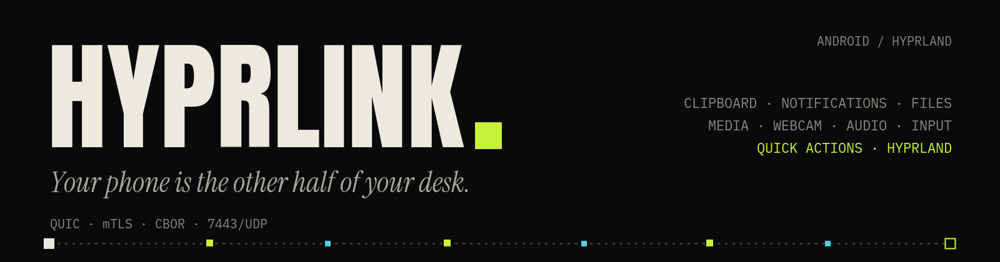
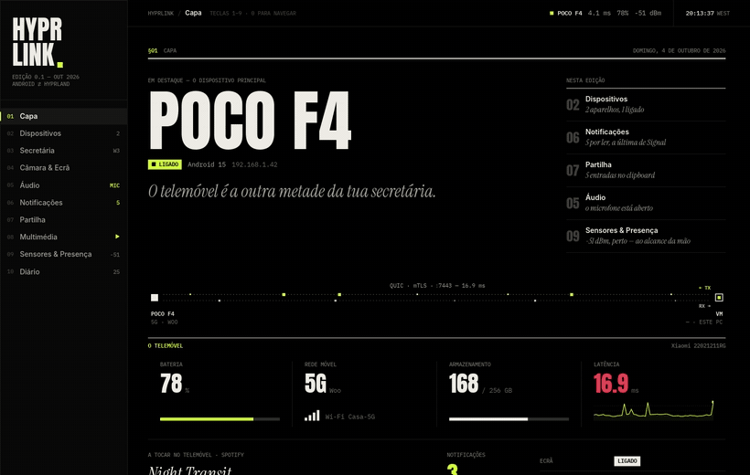

# HyprLink

🇬🇧 **English** · [🇵🇹 Português](README.pt.md) · [🇨🇳 简体中文](README.zh.md)

<p align="center"></p>

**Android ⇄ Linux/Hyprland ecosystem integration** — in the spirit of Apple's Continuity/Handoff, but for people who run Hyprland. Clipboard, notifications, media, battery, remote touchpad and keyboard, file transfer, webcam, audio and Hyprland control, synced between your phone and your desktop in real time, with no cloud service in between.

The link is direct on your local network over **QUIC + mTLS** (mutual authentication with self-signed certificates and fingerprint pinning); the control protocol is serialised in **CBOR**. No relay server: the phone talks straight to the PC.

> **Alpha (0.1.0).** It works day to day for the person who builds it, but the protocol may still change between versions and some modules are incomplete (see [Status](#status)). Use at your own risk; bug reports are welcome.

<p align="center"></p>

## Contents

[Features](#features) · [Status](#status) · [Requirements](#requirements) · [Installation](#installation) · [Pairing](#pairing-your-phone) · [Usage](#usage) · [Configuration](#configuration) · [Troubleshooting](#troubleshooting) · [Architecture](#architecture) · [Building from source](#building-from-source) · [Android app](#android-app) · [Credits](#credits) · [Licence](#licence)

## Features

- **Notifications** from the phone on the PC: mirror, actions, dismiss, and the list of active ones restored when the phone reconnects
- **Two-way clipboard**, including PNG images
- **File transfer** both ways: send queue, progress, history and a configurable download folder
- **Media**: control the PC's MPRIS players from the phone, with position and album cover; the PC player also appears as a notification on the phone
- **Phone as a webcam** for the PC (`/dev/video42` via v4l2loopback) in H.264 or H.265
- **Audio**: the phone's microphone as a PC input, the phone as the PC's speaker, and PC sound sent to the phone
- **Remote touchpad and keyboard** through `/dev/uinput`: live typing, Enter, shortcut keys and mouse buttons (press/release, with a safety release if the link drops)
- **Quick actions**: lock, suspend, screenshot (full screen or area, copied to the clipboard and saved), volume, media keys and `hyprctl dispatch`
- **Hyprland**: workspaces, windows and live events; phone gestures mapped to dispatches. Works with the Lua config (`hyprland.lua`) as well as the classic one
- **Telemetry**: battery in both directions; the PC's CPU, RAM, temperature (hwmon), free disk space and GPU shown on the phone
- **Wake-on-LAN**: the daemon sends the PC's MAC to the phone so it can wake the machine
- **Desktop GUI** (iced) in its own process, with a tray icon and five languages: English, Portuguese (PT and BR), Spanish and Chinese

## Status

| Module | State |
|---|---|
| Connectivity (QUIC/mTLS, QR pairing) | ✅ |
| Desktop GUI (iced, separate from the daemon, tray icon) | ✅ |
| Two-way clipboard | ✅ |
| Hyprland (workspaces, windows, dispatch, live events) | ✅ |
| Battery (PC ↔ phone) | ✅ |
| Media (MPRIS: control, now playing, cover art, phone notification) | ✅ |
| Remote touchpad / keyboard (live typing, Enter, shortcuts) | ✅ |
| Quick actions (lock, suspend, screenshot/area, volume, media) | ✅ |
| Notifications (mirror, actions, dismiss) | ✅ |
| File transfer (send queue, history, open folder) | ✅ |
| Telemetry on the phone (CPU, RAM, temperature, GPU, disk) | 🚧 temperature/GPU still to validate |
| Mouse buttons and drag (`input.button`) | 🚧 daemon and Android app ready; still to test on a phone |
| Phone gestures (`gesture`) | 🚧 daemon, GUI and Android app ready; still to test on a phone |
| Audio (mixer, hear the PC on the phone, virtual microphone) | 🚧 |
| Webcam (phone as PC camera/microphone; H.264 and H.265) | 🚧 |

Full detail is in [`CHANGELOG.md`](CHANGELOG.md) and [`PROTOCOL.md`](PROTOCOL.md).

## Requirements

Tested on **Arch Linux / CachyOS** with **Hyprland** (Wayland). Other distributions should work, but the package names below are Arch's.

| For | Packages (Arch) |
|---|---|
| Base | `hyprland`, `pipewire`, `wireplumber`, `libpulse` (`pactl`), `wl-clipboard` |
| Audio and camera (GStreamer) | `gst-plugins-base-libs`, `gst-plugins-good`, `gst-plugins-bad-libs` (H.265), `gst-libav` (H.264/H.265 decoding), `gst-plugin-pipewire` |
| Virtual webcam | `v4l2loopback-dkms` (the daemon loads it on `/dev/video42` through `pkexec`) |
| GUI file picker | `xdg-desktop-portal` + `xdg-desktop-portal-gtk` |
| Quick actions (optional) | lock: `noctalia`, `hyprlock` or `loginctl`; screenshots: `grimblast` or `grim` + `slurp` |
| Building | `rust`, `clang`, `lld`, `pkgconf` |

The remote touchpad and keyboard write to `/dev/uinput`: the session user needs write permission (check with `getfacl /dev/uinput`).

## Installation

The package is a **local PKGBUILD** in `packaging/arch/`, named `hyprlink-bridge` (on the AUR, "hyprlink" is a different project):

```bash
git clone https://github.com/mastermaiolo/hyprlink.git
cd hyprlink/packaging/arch
makepkg -si
systemctl --user enable --now hyprlink-bridge   # the daemon, as a user service
hyprlink-gui                                     # the GUI (also in your app menu)
```

It installs `hyprlink-daemon`, `hyprlink-gui` and `hyprlinkctl` into `/usr/bin`, the `hyprlink-bridge.service` user unit and a `.desktop` launcher. To try the current checkout before a tag exists: `HYPRLINK_LOCAL=1 makepkg -si`.

The service starts with the graphical session (`graphical-session.target`). With uwsm that is automatic. Without uwsm that target is usually not activated: in Hyprland add `exec-once = dbus-update-activation-environment --systemd --all` and then `exec-once = systemctl --user start hyprlink-bridge`. To start the GUI in the tray at login: `cp /usr/share/hyprlink-bridge/hyprlink-bridge-autostart.desktop ~/.config/autostart/` (uwsm reads XDG autostart) or `exec-once = hyprlink-gui` in Hyprland.

## Pairing your phone

1. Install the Android app (the APK on the [releases page](https://github.com/mastermaiolo/hyprlink/releases); on the phone you must allow "Install unknown apps").
2. With the daemon running, open the GUI on **Devices → Pair new** (or read the QR in the terminal if you started the daemon by hand).
3. In the app, scan the QR. It carries the SHA-256 fingerprint of the PC's certificate, the `<PC-IP>:7443` address and a token that changes at every daemon start and after every pairing.
4. From then on the link resumes by itself whenever both devices are on the same network.

**Network:** the PC and the phone must be on the same LAN. The daemon listens on a single port, **7443/UDP** (QUIC). If you run a firewall, open that port to the local network only.

The PC's identity (certificate and key) lives in `~/.config/hyprlink/`; deleting that folder forces a new pairing.

## Usage

The GUI keeps the **phone first**: it shows the connected device before the PC itself. Keys `1`–`9` jump to a page and `0` opens Settings. The pages are Cover, Devices, Desk, Camera & Screen, Audio, Notifications, Sharing, Multimedia, Sensors & Presence and Diary.

For scripts, shortcuts and bars there is `hyprlinkctl`:

```
hyprlinkctl status         connection state
hyprlinkctl ping           round-trip to the phone
hyprlinkctl mic toggle     phone microphone on/off     (on | off | toggle)
hyprlinkctl tap toggle     send PC audio to the phone
hyprlinkctl speaker toggle phone as the PC's speaker
hyprlinkctl ws 3           switch to workspace 3
hyprlinkctl open           open (or focus) the GUI
```

`hyprlinkctl --help` lists the rest. `contrib/` has a Waybar widget and a "Send via HyprLink" `.desktop` entry for your file manager's context menu; `contrib/install.sh` installs them.

## Configuration

Settings live in `~/.config/hyprlink/config.json` and are edited from the GUI (**Settings**, and **Desk** for gestures, shortcuts and trackpad). Worth knowing:

- `download_dir` — where received files go
- `track` — touchpad sensitivity, scroll speed, acceleration, natural scrolling and the phone-keyboard toggle
- `shortcuts` and `gestures` — the `hyprctl dispatch` commands the phone can trigger
- `battery_alerts` — low and full battery thresholds
- `disk_path` — which mount's free space is shown on the phone (defaults to `$HOME`)
- `gpu_nvidia_wake` — read NVIDIA GPU load even if the card is asleep (off by default, so telemetry never wakes it)
- `lang` — GUI language

`HYPRLINK_MOCK=1 hyprlink-gui` opens the GUI against a simulated daemon, with no phone.

## Troubleshooting

- **The phone can't connect.** Same LAN? Is **7443/UDP** open? Check `systemctl --user status hyprlink-bridge`. If it still fails, remove the device in the GUI and pair again.
- **Touchpad or keyboard do nothing.** The session user needs write access to `/dev/uinput` (`getfacl /dev/uinput`).
- **No webcam.** Install `v4l2loopback-dkms`; the daemon asks for permission (`pkexec`) to load it on `/dev/video42`.
- **The service doesn't start at login.** Without uwsm, see the `graphical-session.target` note under [Installation](#installation).
- **Lock or screenshot does nothing.** Install a lock command (`noctalia`, `hyprlock`) and `grimblast` or `grim` + `slurp`.
- **Start over.** Delete `~/.config/hyprlink/` (this also forgets all pairings).

## Architecture

```
├── crates/
│   ├── hyprlinkd/            Daemon (Rust, binary hyprlink-daemon) — no window
│   ├── hyprlink-gui/         Desktop GUI (iced, with its own tray icon)
│   ├── hyprlink-proto/       Contract between daemon, GUI and hyprlinkctl (+ texts in fmt.rs)
│   └── hyprlinkctl/          Command line, for scripts and keybinds
├── contrib/                  Waybar, .desktop, install script
├── packaging/arch/           Local PKGBUILD (package hyprlink-bridge)
├── scripts/                  hyprlink-start.sh / hyprlink-stop.sh (daemon + GUI), gui-capture.sh, release.sh
├── CHANGELOG.md              Changes per version
└── PROTOCOL.md               Protocol specification (source of truth)
```

The daemon has no window; the GUI is a separate process that talks to it over `$XDG_RUNTIME_DIR/hyprlink.sock`. Between PC and phone, a single QUIC connection on 7443/UDP carries control messages (CBOR over a bidirectional stream), data (unidirectional streams) and PC audio (QUIC DATAGRAM). The full wire specification — framing, CBOR format and the packet catalogue per module — is in [`PROTOCOL.md`](PROTOCOL.md).

Stack: [`quinn`](https://github.com/quinn-rs/quinn) (QUIC), `rustls` (TLS), `ciborium` (CBOR), [`iced`](https://github.com/iced-rs/iced) (GUI), `ksni` (tray), `zbus` (D-Bus — MPRIS and notifications), `uinput` (touchpad/keyboard), GStreamer/PipeWire (audio and camera).

## Building from source

```bash
# the easy way: starts the daemon and the GUI (uses the binaries in target/release)
scripts/hyprlink-start.sh            # --restart to restart; hyprlink-stop.sh to stop

# or by hand, in two terminals
cargo run --release -p hyprlinkd     # the daemon (prints the pairing QR)
cargo run --release -p hyprlink-gui  # the GUI
```

The repo ships a `.cargo/config.toml` using **`clang` + `lld`** as the linker (`pacman -S clang lld`): linking a debug daemon drops from ~5 s to ~2 s.

```bash
cargo build --profile fast -p hyprlinkd   # to iterate: no LTO, 16 codegen units
cargo build --release -p hyprlinkd        # to distribute (LTO, overflow-checks = true)
```

The `fast` profile inherits from `release` with `lto = false`, `codegen-units = 16` and `overflow-checks = false`; **it is not for distribution**.

## Android app

The Android app (Kotlin/Jetpack Compose) is developed and distributed separately; this repository holds only the PC side: daemon, GUI and `hyprlinkctl`. For now the app will be offered as a signed APK on this repository's [Releases](https://github.com/mastermaiolo/hyprlink/releases) page (not published yet). If you want to write another client, the full protocol is in [`PROTOCOL.md`](PROTOCOL.md).

## Credits

[`quinn`](https://github.com/quinn-rs/quinn), [`rustls`](https://github.com/rustls/rustls), [`iced`](https://github.com/iced-rs/iced), `ciborium`, `ksni` and `zbus` do the heavy lifting. The fonts bundled in the GUI and the app — Anton, Instrument Serif, Inter, IBM Plex Mono and Noto Sans SC — are under the SIL Open Font License 1.1; their texts are in `crates/hyprlink-gui/assets/fonts/OFL-*.txt`.

## Licence

**GPL-3.0-or-later** — see [`LICENSE`](LICENSE).

**Relicensing:** up to 0.1.0 the code was published under MIT. Since the project has a single author, from 0.1.0 it is GPL-3.0-or-later. Anyone who received earlier versions can keep using them under MIT's terms.
