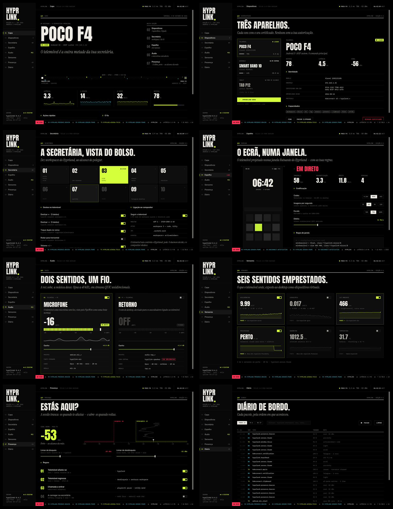

# HyprLink

Integração de ecossistema entre Android e Linux/Hyprland — no espírito do
Continuity/Handoff da Apple, mas para quem usa Hyprland. Clipboard,
notificações, mídia, bateria, touchpad/teclado remoto e controlo do Hyprland
sincronizados entre o telemóvel e o desktop, em tempo real, sem depender de
nenhum serviço na nuvem.

A ligação é direta na rede local via **QUIC + mTLS** (autenticação mútua por
certificados autoassinados, fingerprint pinning), com o protocolo de controlo
serializado em **CBOR**. Sem servidor intermediário: o telemóvel fala
diretamente com o PC.

> **Versão alfa (0.1.0).** Funciona no dia a dia de quem o desenvolve, mas o
> protocolo ainda pode mudar entre versões e há módulos incompletos (ver
> [Estado atual](#estado-atual)). Use por sua conta e risco; relatórios de
> erros são bem-vindos.



*English summary at the [end of this file](#english).*

## Onde está o quê

```
├── crates/
│   ├── hyprlinkd/            Daemon (Rust, binário hyprlink-daemon) — sem janela
│   ├── hyprlink-gui/         GUI do PC (iced, com tray próprio)
│   ├── hyprlink-proto/       Contrato entre daemon, GUI e hyprlinkctl (+ textos em fmt.rs)
│   └── hyprlinkctl/          Linha de comandos, para scripts e atalhos
├── app android hyprlink/     App Android (Kotlin/Compose), com origem no Google AI Studio
├── android-design-kit/       Kit de design da app: tokens, mockups e prompts
│   └── prompts/              Prompts por aplicar (ordem em ORDEM.md); os feitos em prompts/Done/
├── docs/
│   ├── prompts-ai-studio/    Prompts soltos para o AI Studio (aplicados em aplicados/)
│   ├── testes/               Relatórios do teste real e o prompt do Claude Code
│   └── historico/            Planos e materiais antigos, só para consulta
├── contrib/                  Waybar, .desktop, script de instalação
├── scripts/                  hyprlink-start.sh / hyprlink-stop.sh (daemon + GUI), gui-capture.sh
├── PLANO_COMPLETAR.md        Estado e plano (a secção do topo é a mais recente)
└── PROTOCOL.md               Especificação do protocolo (fonte de verdade)
```

## Estado atual

| Módulo | Estado |
|---|---|
| Conectividade (QUIC/mTLS, pareamento por QR) | ✅ |
| GUI do PC (iced, separada do daemon, tray próprio) | ✅ |
| Clipboard bidirecional | ✅ |
| Hyprland (workspaces, janelas, dispatch, eventos ao vivo) | ✅ |
| Bateria (PC ↔ telemóvel) | ✅ |
| Mídia (MPRIS: controlo, now-playing, capa e notificação no telemóvel) | ✅ |
| Touchpad / teclado remoto (escrita ao vivo, Enter, atalhos) | ✅ |
| Ações rápidas (bloquear, suspender, captura de ecrã/área, volume, mídia) | ✅ |
| Notificações (espelhar, ações, dispensar) | ✅ |
| Transferência de ficheiros (fila de envios, histórico, abrir pasta) | ✅ |
| Telemetria no telemóvel (CPU, RAM, temperatura, GPU, disco) | 🚧 temperatura/GPU a validar |
| Botões do rato e arrastar (`input.button`) | 🚧 daemon pronto; falta a app |
| Gestos no telemóvel (`gesture`) | 🚧 daemon e GUI prontos; falta a app |
| Áudio (mixer, ouvir o PC no telemóvel, microfone virtual) | 🚧 |
| Webcam (telemóvel como câmara/microfone do PC; H.264 e H.265) | 🚧 |

Detalhes de cada fase, decisões de arquitetura e o roteiro completo estão no
histórico de commits e em `PROTOCOL.md`.

## Requisitos

Testado em **Arch Linux / CachyOS** com **Hyprland** (Wayland). Outras
distribuições devem funcionar, mas os nomes de pacotes abaixo são os do Arch.

| Para quê | Pacotes (Arch) |
|---|---|
| Base | `hyprland`, `pipewire`, `wireplumber`, `libpulse` (`pactl`), `wl-clipboard` |
| Áudio e câmara (GStreamer) | `gst-plugins-base-libs`, `gst-plugins-good`, `gst-plugins-bad-libs` (H.265), `gst-libav` (descodificação H.264/H.265), `gst-plugin-pipewire` |
| Webcam virtual | `v4l2loopback-dkms` (o daemon carrega-o em `/dev/video42` via `pkexec`) |
| Seletor de ficheiros da GUI | `xdg-desktop-portal` + `xdg-desktop-portal-gtk` |
| Ações rápidas, opcional | bloqueio: `noctalia`, `hyprlock` ou `loginctl`; capturas: `grimblast` ou `grim` + `slurp` |
| Compilar | `rust`, `clang`, `lld`, `pkgconf` |

O touchpad e o teclado remotos escrevem em `/dev/uinput`: o utilizador da
sessão precisa de permissão de escrita (confirme com `getfacl /dev/uinput`).

## Instalar (Arch / CachyOS)

O pacote é um **PKGBUILD local** em `packaging/arch/` e chama-se
`hyprlink-bridge` (no AUR, «hyprlink» já é outro projeto, o `hyprlink-git`):

```bash
git clone https://github.com/mastermaiolo/hyprlink.git
cd hyprlink/packaging/arch
makepkg -si
systemctl --user enable --now hyprlink-bridge   # o daemon, como serviço de utilizador
hyprlink-gui                                     # a GUI (também no menu de aplicações)
```

Instala `hyprlink-daemon`, `hyprlink-gui` e `hyprlinkctl` em `/usr/bin`, o
serviço systemd de utilizador `hyprlink-bridge.service` e o atalho `.desktop`.
Para testar a partir desta cópia do código, antes de existir a tag:
`HYPRLINK_LOCAL=1 makepkg -si`.

O serviço arranca com a sessão gráfica (`graphical-session.target`). Com uwsm
isso é automático. Sem uwsm, esse alvo em geral não é ativado: no Hyprland,
`exec-once = dbus-update-activation-environment --systemd --all` e depois
`exec-once = systemctl --user start hyprlink-bridge`.
Para a GUI arrancar na bandeja ao entrar na sessão:
`cp /usr/share/hyprlink-bridge/hyprlink-bridge-autostart.desktop ~/.config/autostart/`
(uwsm lê o autostart XDG) ou `exec-once = hyprlink-gui` no Hyprland.

## Emparelhar o telemóvel

1. Instale a app Android (APK das [releases](https://github.com/mastermaiolo/hyprlink/releases);
   no telemóvel é preciso permitir «Instalar apps desconhecidas»).
2. Com o daemon a correr, abra a GUI em **Dispositivos → Emparelhar novo**
   (ou veja o QR no terminal, se correu o daemon à mão).
3. Na app, leia o QR. Ele leva a impressão digital SHA-256 do certificado do
   PC, o endereço `<IP-DO-PC>:7443` e um token que muda a cada arranque do
   daemon e depois de cada emparelhamento.
4. A partir daí a ligação é retomada sozinha sempre que os dois estiverem na
   mesma rede.

**Rede:** PC e telemóvel têm de estar na mesma LAN. O daemon escuta numa só
porta, **7443/UDP** (QUIC). Se tiver firewall, abra essa porta só para a
rede local.

A identidade do PC (certificado e chave) fica em `~/.config/hyprlink/`;
apagar essa pasta obriga a emparelhar de novo.

## Correr a partir do código (desenvolvimento)

```bash
# o mais simples: arranca o daemon e a GUI (usa os binários de target/release)
scripts/hyprlink-start.sh            # --restart para reiniciar; hyprlink-stop.sh para parar

# ou à mão, em dois terminais
cargo run --release -p hyprlinkd     # o daemon (mostra o QR de emparelhamento)
cargo run --release -p hyprlink-gui  # a GUI
```

Na primeira execução o daemon gera um certificado próprio. A GUI fala com ele
pelo socket `$XDG_RUNTIME_DIR/hyprlink.sock`; `HYPRLINK_MOCK=1` abre-a com um
daemon simulado, sem telemóvel.

Stack: [`quinn`](https://github.com/quinn-rs/quinn) (QUIC), `rustls` (TLS),
`ciborium` (CBOR), [`iced`](https://github.com/iced-rs/iced) (GUI), `ksni`
(tray), `zbus` (D-Bus — MPRIS e notificações), `uinput` (touchpad/teclado),
GStreamer/PipeWire (áudio e câmara).

## Compilar

O repositório traz `.cargo/config.toml` com **`clang` + `lld`** como ligador
(`pacman -S clang lld`): o *link* de um build debug do daemon passa de ~5 s
para ~2 s. No release o ganho é nulo (o tempo vai para o LTO e o codegen).

```bash
cargo build --profile fast -p hyprlinkd   # para iterar: sem LTO, 16 unidades de codegen
cargo build --release -p hyprlinkd        # para distribuir (LTO, overflow-checks = true)
```

O perfil `fast` herda do `release` com `lto = false`, `codegen-units = 16` e
`overflow-checks = false`; **não é para distribuir**. A primeira compilação
depois de mudar o ligador recompila tudo (as `rustflags` mudam).

Opcional, nada disto está ligado por omissão: `mold` (`paru -S mold`, depois
`-C link-arg=-fuse-ld=mold` no lugar de `lld`) liga ainda mais depressa; e
`sccache` (`paru -S sccache` + `RUSTC_WRAPPER=sccache`) só compensa com vários
`target` ou depois de `cargo clean`, porque o `cargo` já guarda o que não mudou.

## App Android

Em `app android hyprlink/` — projeto Kotlin/Jetpack Compose que nasceu no
[Google AI Studio](https://ai.studio) e é hoje evoluído a partir do
`android-design-kit/` (design, mockups e prompts por ordem em `ORDEM.md`).
Abra a pasta no Android Studio para compilar. O pacote de release assinado
usa variáveis de ambiente (`KEYSTORE_PATH`, `STORE_PASSWORD`, `KEY_PASSWORD`);
nunca guarde a keystore nem as palavras-passe no repositório.

## Protocolo

Toda a especificação de wire — framing, formato CBOR, catálogo completo de
pacotes por módulo — está em [`PROTOCOL.md`](PROTOCOL.md), extraída
diretamente do código-fonte do app (não é documentação escrita à parte, é a
fonte de verdade real).

## Licença

**GPL-3.0-or-later** — veja [`LICENSE`](LICENSE).

**Relicenciamento:** até à 0.1.0 o código foi publicado sob MIT. Como o
projeto tem um só autor, a partir da 0.1.0 passa a GPL-3.0-or-later. Quem
recebeu versões anteriores continua a poder usá-las nos termos da MIT.

As fontes embutidas na GUI e na app (Anton, Instrument Serif, Inter,
IBM Plex Mono, Noto Sans SC) são SIL Open Font License 1.1; os textos estão
em `crates/hyprlink-gui/assets/fonts/OFL-*.txt`.

## English

**HyprLink** links an Android phone to a Linux desktop running Hyprland:
clipboard, notifications, media (MPRIS, with cover art), battery, remote
touchpad and keyboard, quick actions, file transfer, the phone as a webcam
(H.264/H.265 via v4l2loopback) and microphone, and live Hyprland control. It
talks directly over the local network with **QUIC + mutual TLS** (self-signed
certificates, fingerprint pinning, CBOR protocol): no cloud, no relay server.

**Status: alpha (0.1.0).** The protocol may still change between versions.

- **Requirements:** Arch Linux / CachyOS, Hyprland, PipeWire + WirePlumber,
  GStreamer (base, good, bad, libav, pipewire), `wl-clipboard`; optional:
  `v4l2loopback-dkms`, `grimblast` or `grim` + `slurp`, `hyprlock`/`noctalia`.
- **Install:** `cd packaging/arch && makepkg -si` (package name
  `hyprlink-bridge`), then `systemctl --user enable --now hyprlink-bridge`
  and launch `hyprlink-gui`.
- **Pairing:** install the Android APK from the releases page, open
  *Devices → Pair new* in the GUI and scan the QR code. Phone and PC must be
  on the same LAN; the daemon listens on **7443/UDP** only.
- **Development:** `scripts/hyprlink-start.sh` starts the daemon and the GUI
  from `target/release`.
- **License:** GPL-3.0-or-later (versions before 0.1.0 were MIT). The GUI is
  available in Portuguese (PT/BR), English, Spanish and Chinese.
