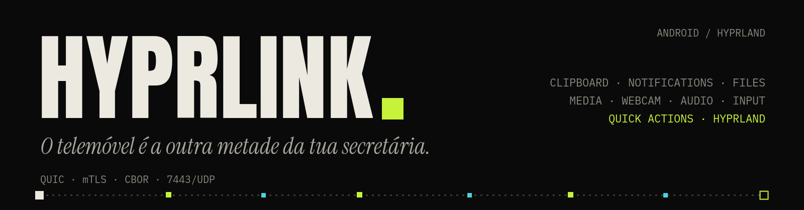

# HyprLink

[🇬🇧 English](README.md) · 🇵🇹 **Português** · [🇨🇳 简体中文](README.zh.md)

<p align="center"></p>

**Integração de ecossistema entre Android e Linux/Hyprland** — no espírito do Continuity/Handoff da Apple, mas para quem usa Hyprland. Clipboard, notificações, mídia, bateria, touchpad e teclado remotos, transferência de ficheiros, webcam, áudio e controlo do Hyprland sincronizados entre o telemóvel e o desktop, em tempo real, sem depender de nenhum serviço na nuvem.

A ligação é direta na rede local via **QUIC + mTLS** (autenticação mútua por certificados autoassinados, com *fingerprint pinning*); o protocolo de controlo é serializado em **CBOR**. Sem servidor intermédio: o telemóvel fala diretamente com o PC.

> **Versão alfa (0.1.0).** Funciona no dia a dia de quem o desenvolve, mas o protocolo ainda pode mudar entre versões e há módulos incompletos (ver [Estado](#estado)). Use por sua conta e risco; relatórios de erros são bem-vindos.

<p align="center"></p>

## Índice

[Funcionalidades](#funcionalidades) · [Estado](#estado) · [Requisitos](#requisitos) · [Instalação](#instalação) · [Emparelhar](#emparelhar-o-telemóvel) · [Utilização](#utilização) · [Configuração](#configuração) · [Resolução de problemas](#resolução-de-problemas) · [Arquitetura](#arquitetura) · [Compilar](#compilar-a-partir-do-código) · [App Android](#app-android) · [Créditos](#créditos) · [Licença](#licença)

## Funcionalidades

- **Notificações** do telemóvel no PC: espelhar, ações, dispensar, e a lista de ativas reposta quando o telemóvel volta a ligar
- **Clipboard** bidirecional, incluindo imagens PNG
- **Ficheiros** nos dois sentidos: fila de envios, progresso, histórico e pasta de transferências configurável
- **Mídia**: controla os leitores MPRIS do PC a partir do telemóvel, com posição e capa do álbum; o leitor do PC aparece também como notificação no telemóvel
- **Telemóvel como webcam** do PC (`/dev/video42` via v4l2loopback), em H.264 ou H.265
- **Áudio**: o microfone do telemóvel como entrada do PC, o telemóvel como coluna do PC e o som do PC enviado para o telemóvel
- **Touchpad e teclado remotos** por `/dev/uinput`: escrita ao vivo, Enter, teclas de atalho e botões do rato (premir/largar, com soltura de segurança se a ligação cair)
- **Ações rápidas**: bloquear, suspender, captura de ecrã (inteiro ou de uma área, copiada para o clipboard e guardada), volume, teclas de mídia e `hyprctl dispatch`
- **Hyprland**: workspaces, janelas e eventos ao vivo; gestos do telemóvel mapeados para despachos. Funciona com a configuração em Lua (`hyprland.lua`) e com a clássica
- **Telemetria**: bateria nos dois sentidos; CPU, RAM, temperatura (hwmon), espaço livre em disco e GPU do PC mostrados no telemóvel
- **Wake-on-LAN**: o daemon envia o MAC do PC ao telemóvel para este o poder acordar
- **GUI de secretária** (iced) num processo à parte, com ícone na bandeja e cinco idiomas: português (PT e BR), inglês, espanhol e chinês

## Estado

| Módulo | Estado |
|---|---|
| Conectividade (QUIC/mTLS, emparelhamento por QR) | ✅ |
| GUI do PC (iced, separada do daemon, ícone na bandeja) | ✅ |
| Clipboard bidirecional | ✅ |
| Hyprland (workspaces, janelas, dispatch, eventos ao vivo) | ✅ |
| Bateria (PC ↔ telemóvel) | ✅ |
| Mídia (MPRIS: controlo, a tocar, capa, notificação no telemóvel) | ✅ |
| Touchpad / teclado remoto (escrita ao vivo, Enter, atalhos) | ✅ |
| Ações rápidas (bloquear, suspender, captura de ecrã/área, volume, mídia) | ✅ |
| Notificações (espelhar, ações, dispensar) | ✅ |
| Transferência de ficheiros (fila de envios, histórico, abrir pasta) | ✅ |
| Telemetria no telemóvel (CPU, RAM, temperatura, GPU, disco) | 🚧 temperatura/GPU por validar |
| Botões do rato e arrastar (`input.button`) | 🚧 daemon e app Android prontos; por testar no telemóvel |
| Gestos no telemóvel (`gesture`) | 🚧 daemon, GUI e app Android prontos; por testar no telemóvel |
| Áudio (mixer, ouvir o PC no telemóvel, microfone virtual) | 🚧 |
| Webcam (telemóvel como câmara/microfone do PC; H.264 e H.265) | 🚧 |

O detalhe está no [`CHANGELOG.md`](CHANGELOG.md) e no [`PROTOCOL.md`](PROTOCOL.md).

## Requisitos

Testado em **Arch Linux / CachyOS** com **Hyprland** (Wayland). Outras distribuições devem funcionar, mas os nomes de pacotes abaixo são os do Arch.

| Para quê | Pacotes (Arch) |
|---|---|
| Base | `hyprland`, `pipewire`, `wireplumber`, `libpulse` (`pactl`), `wl-clipboard` |
| Áudio e câmara (GStreamer) | `gst-plugins-base-libs`, `gst-plugins-good`, `gst-plugins-bad-libs` (H.265), `gst-libav` (descodificação H.264/H.265), `gst-plugin-pipewire` |
| Webcam virtual | `v4l2loopback-dkms` (o daemon carrega-o em `/dev/video42` via `pkexec`) |
| Seletor de ficheiros da GUI | `xdg-desktop-portal` + `xdg-desktop-portal-gtk` |
| Ações rápidas (opcional) | bloqueio: `noctalia`, `hyprlock` ou `loginctl`; capturas: `grimblast` ou `grim` + `slurp` |
| Compilar | `rust`, `clang`, `lld`, `pkgconf` |

O touchpad e o teclado remotos escrevem em `/dev/uinput`: o utilizador da sessão precisa de permissão de escrita (confirme com `getfacl /dev/uinput`).

## Instalação

O pacote é um **PKGBUILD local** em `packaging/arch/`, chamado `hyprlink-bridge` (no AUR, «hyprlink» é outro projeto):

```bash
git clone https://github.com/mastermaiolo/hyprlink.git
cd hyprlink/packaging/arch
makepkg -si
systemctl --user enable --now hyprlink-bridge   # o daemon, como serviço de utilizador
hyprlink-gui                                     # a GUI (também no menu de aplicações)
```

Instala `hyprlink-daemon`, `hyprlink-gui` e `hyprlinkctl` em `/usr/bin`, o serviço systemd de utilizador `hyprlink-bridge.service` e o atalho `.desktop`. Para testar a partir desta cópia do código, antes de existir a tag: `HYPRLINK_LOCAL=1 makepkg -si`.

O serviço arranca com a sessão gráfica (`graphical-session.target`). Com uwsm isso é automático. Sem uwsm, esse alvo em geral não é ativado: no Hyprland, `exec-once = dbus-update-activation-environment --systemd --all` e depois `exec-once = systemctl --user start hyprlink-bridge`. Para a GUI arrancar na bandeja ao entrar na sessão: `cp /usr/share/hyprlink-bridge/hyprlink-bridge-autostart.desktop ~/.config/autostart/` (uwsm lê o autostart XDG) ou `exec-once = hyprlink-gui` no Hyprland.

## Emparelhar o telemóvel

1. Instale a app Android (o APK da [página de releases](https://github.com/mastermaiolo/hyprlink/releases); no telemóvel é preciso permitir «Instalar apps desconhecidas»).
2. Com o daemon a correr, abra a GUI em **Dispositivos → Emparelhar novo** (ou leia o QR no terminal, se correu o daemon à mão).
3. Na app, leia o QR. Ele leva a impressão digital SHA-256 do certificado do PC, o endereço `<IP-DO-PC>:7443` e um token que muda a cada arranque do daemon e depois de cada emparelhamento.
4. A partir daí a ligação é retomada sozinha sempre que os dois estiverem na mesma rede.

**Rede:** o PC e o telemóvel têm de estar na mesma LAN. O daemon escuta numa só porta, **7443/UDP** (QUIC). Se tiver firewall, abra essa porta só para a rede local.

A identidade do PC (certificado e chave) fica em `~/.config/hyprlink/`; apagar essa pasta obriga a emparelhar de novo.

## Utilização

A GUI mostra **primeiro o telemóvel**: o dispositivo ligado vem antes do próprio PC. As teclas `1`–`9` saltam para uma página e `0` abre as Definições. As páginas são Capa, Dispositivos, Secretária, Câmara & Ecrã, Áudio, Notificações, Partilha, Multimédia, Sensores & Presença e Diário.

Para scripts, atalhos e barras existe o `hyprlinkctl`:

```
hyprlinkctl status         estado da ligação
hyprlinkctl ping           tempo de ida e volta ao telemóvel
hyprlinkctl mic toggle     microfone do telemóvel ligado/desligado   (on | off | toggle)
hyprlinkctl tap toggle     enviar o áudio do PC para o telemóvel
hyprlinkctl speaker toggle telemóvel como coluna do PC
hyprlinkctl ws 3           mudar para o workspace 3
hyprlinkctl open           abrir (ou focar) a GUI
```

O `hyprlinkctl --help` lista o resto. Em `contrib/` há um widget de Waybar e uma entrada `.desktop` «Enviar via HyprLink» para o menu de contexto do gestor de ficheiros; o `contrib/install.sh` instala-os.

## Configuração

As definições ficam em `~/.config/hyprlink/config.json` e editam-se na GUI (**Definições**, e **Secretária** para gestos, atalhos e trackpad). O que vale a pena saber:

- `download_dir` — para onde vão os ficheiros recebidos
- `track` — sensibilidade do touchpad, velocidade do scroll, aceleração, scroll natural e o teclado do telemóvel
- `shortcuts` e `gestures` — os comandos `hyprctl dispatch` que o telemóvel pode disparar
- `battery_alerts` — limites de bateria fraca e cheia
- `disk_path` — o ponto de montagem cujo espaço livre aparece no telemóvel (por omissão, `$HOME`)
- `gpu_nvidia_wake` — ler a carga da GPU NVIDIA mesmo com a placa adormecida (desligado por omissão, para a telemetria nunca a acordar)
- `lang` — idioma da GUI

`HYPRLINK_MOCK=1 hyprlink-gui` abre a GUI com um daemon simulado, sem telemóvel.

## Resolução de problemas

- **O telemóvel não liga.** Mesma LAN? A porta **7443/UDP** está aberta? Veja `systemctl --user status hyprlink-bridge`. Se continuar, remova o dispositivo na GUI e emparelhe de novo.
- **Touchpad ou teclado não fazem nada.** O utilizador da sessão precisa de acesso de escrita a `/dev/uinput` (`getfacl /dev/uinput`).
- **Sem webcam.** Instale o `v4l2loopback-dkms`; o daemon pede permissão (`pkexec`) para o carregar em `/dev/video42`.
- **O serviço não arranca ao entrar na sessão.** Sem uwsm, veja a nota sobre o `graphical-session.target` na [Instalação](#instalação).
- **Bloquear ou captura de ecrã não fazem nada.** Instale um comando de bloqueio (`noctalia`, `hyprlock`) e o `grimblast` ou `grim` + `slurp`.
- **Recomeçar do zero.** Apague `~/.config/hyprlink/` (isto também esquece todos os emparelhamentos).

## Arquitetura

```
├── crates/
│   ├── hyprlinkd/            Daemon (Rust, binário hyprlink-daemon) — sem janela
│   ├── hyprlink-gui/         GUI do PC (iced, com ícone próprio na bandeja)
│   ├── hyprlink-proto/       Contrato entre daemon, GUI e hyprlinkctl (+ textos em fmt.rs)
│   └── hyprlinkctl/          Linha de comandos, para scripts e atalhos
├── contrib/                  Waybar, .desktop, script de instalação
├── packaging/arch/           PKGBUILD local (pacote hyprlink-bridge)
├── scripts/                  hyprlink-start.sh / hyprlink-stop.sh (daemon + GUI), gui-capture.sh, release.sh
├── CHANGELOG.md              Alterações por versão
└── PROTOCOL.md               Especificação do protocolo (fonte de verdade)
```

O daemon não tem janela; a GUI é um processo à parte que fala com ele pelo socket `$XDG_RUNTIME_DIR/hyprlink.sock`. Entre o PC e o telemóvel, uma só ligação QUIC na 7443/UDP leva as mensagens de controlo (CBOR sobre um *stream* bidirecional), os dados (*streams* unidirecionais) e o áudio do PC (QUIC DATAGRAM). A especificação completa — *framing*, formato CBOR e o catálogo de pacotes por módulo — está no [`PROTOCOL.md`](PROTOCOL.md).

Stack: [`quinn`](https://github.com/quinn-rs/quinn) (QUIC), `rustls` (TLS), `ciborium` (CBOR), [`iced`](https://github.com/iced-rs/iced) (GUI), `ksni` (bandeja), `zbus` (D-Bus — MPRIS e notificações), `uinput` (touchpad/teclado), GStreamer/PipeWire (áudio e câmara).

## Compilar a partir do código

```bash
# o mais simples: arranca o daemon e a GUI (usa os binários de target/release)
scripts/hyprlink-start.sh            # --restart para reiniciar; hyprlink-stop.sh para parar

# ou à mão, em dois terminais
cargo run --release -p hyprlinkd     # o daemon (mostra o QR de emparelhamento)
cargo run --release -p hyprlink-gui  # a GUI
```

O repositório traz um `.cargo/config.toml` com **`clang` + `lld`** como ligador (`pacman -S clang lld`): o *link* de um build debug do daemon passa de ~5 s para ~2 s.

```bash
cargo build --profile fast -p hyprlinkd   # para iterar: sem LTO, 16 unidades de codegen
cargo build --release -p hyprlinkd        # para distribuir (LTO, overflow-checks = true)
```

O perfil `fast` herda do `release` com `lto = false`, `codegen-units = 16` e `overflow-checks = false`; **não é para distribuir**.

## App Android

A app Android (Kotlin/Jetpack Compose) é desenvolvida e distribuída à parte; este repositório tem só o lado do PC: daemon, GUI e `hyprlinkctl`. Por agora, a app será disponibilizada como APK assinado nos [Releases](https://github.com/mastermaiolo/hyprlink/releases) deste repositório (ainda não publicado). Quem quiser escrever outro cliente tem o protocolo completo no [`PROTOCOL.md`](PROTOCOL.md).

## Créditos

[`quinn`](https://github.com/quinn-rs/quinn), [`rustls`](https://github.com/rustls/rustls), [`iced`](https://github.com/iced-rs/iced), `ciborium`, `ksni` e `zbus` fazem o trabalho pesado. As fontes embutidas na GUI e na app — Anton, Instrument Serif, Inter, IBM Plex Mono e Noto Sans SC — são SIL Open Font License 1.1; os textos estão em `crates/hyprlink-gui/assets/fonts/OFL-*.txt`.

## Licença

**GPL-3.0-or-later** — veja [`LICENSE`](LICENSE).

**Relicenciamento:** até à 0.1.0 o código foi publicado sob MIT. Como o projeto tem um só autor, a partir da 0.1.0 passa a GPL-3.0-or-later. Quem recebeu versões anteriores continua a poder usá-las nos termos da MIT.
