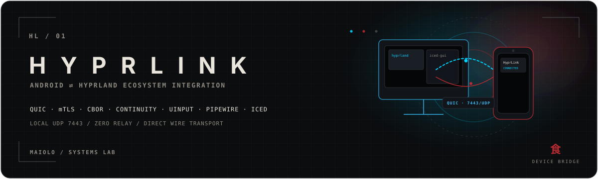
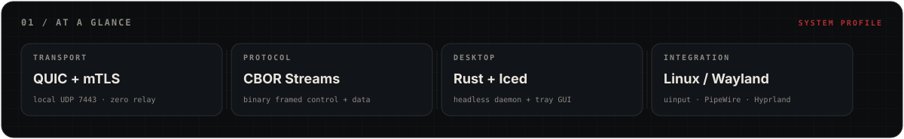
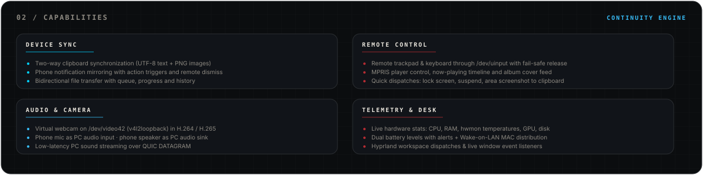
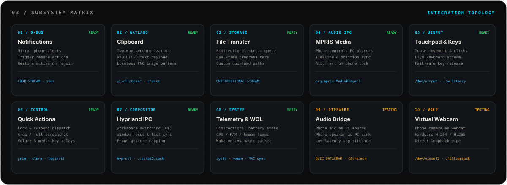
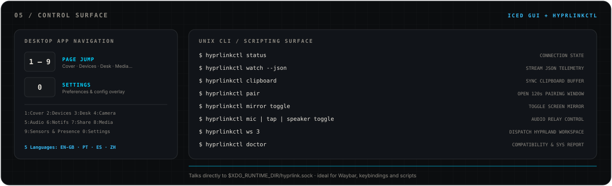
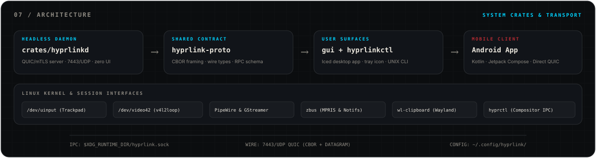
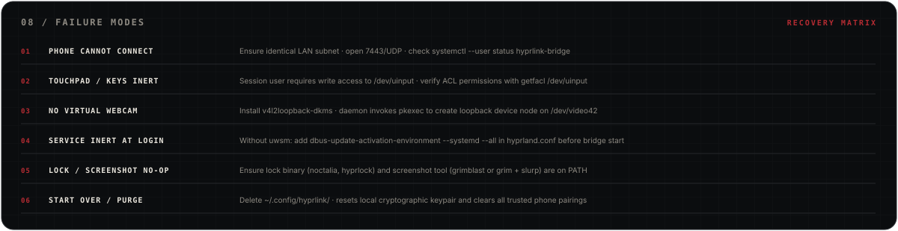
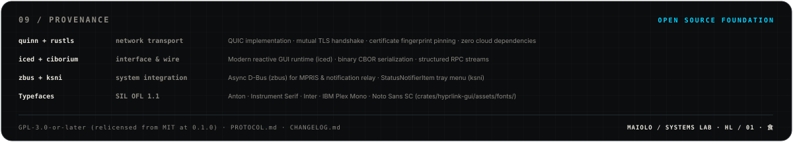

<!-- MAIOLO / SYSTEMS LAB — HYPRLINK -->

<p align="center">
  
</p>

<p align="center"><sub><strong>ANDROID ⇄ LINUX/HYPRLAND · QUIC + mTLS · CBOR · 连续互通 · UINPUT</strong></sub></p>

<p align="center">
  <a href="README.md">🇬🇧 English (UK)</a>
  · <a href="README.pt-br.md">🇧🇷 Português (BR)</a>
  · <a href="README.pt-pt.md">🇵🇹 Português (PT)</a>
  · <a href="README.es-es.md">🇪🇸 Español (ES)</a>
  · 🇨🇳 <strong>简体中文</strong>
  · <a href="CHANGELOG.md">CHANGELOG</a>
  · <a href="PROTOCOL.md">PROTOCOL</a>
</p>

> **Android ⇄ Linux/Hyprland 生态整合** — 理念类似苹果的 Continuity/Handoff，但面向 Hyprland 桌面环境专门构建。剪贴板、通知、媒体控制、电池电量、远程触控板与键盘、文件传输、虚拟摄像头、音频流与合成器控制，全部在局域网内通过直连 QUIC + mTLS 实时同步，无需任何中继云服务。

> [!NOTE]
> **Alpha 版本（0.1.0）。** 开发者本人日常可用，但协议在版本之间仍可能调整，部分模块仍在测试验证阶段（参见 [03 / 子系统矩阵](#03--子系统矩阵)）。欢迎提交问题反馈与代码贡献。

<p align="center">
  
</p>

---

## 01 / 系统概览

<p align="center">
  
</p>

连接在局域网内直接建立，采用 **QUIC + mTLS**（自签名证书双向认证，并进行证书指纹固定）；控制信令协议采用 **CBOR** 二进制序列化。无需中继服务器：手机在 **7443/UDP** 端口直接与电脑端通信。

---

## 02 / 系统功能

<p align="center">
  
</p>

### 具体功能实现

- **通知同步**：手机通知实时镜像至桌面，支持远程操作触发与清除，重连后自动恢复仍处于活跃状态的通知列表。
- **双向剪贴板**：无缝双向剪贴板同步，支持原始 UTF-8 文本与无损 PNG 图像缓冲区。
- **文件传输**：双向文件传输队列，支持实时传输进度跟踪、传输历史记录以及自定义接收目录。
- **媒体控制**：在手机上控制电脑的 MPRIS 播放器（附带播放进度与专辑封面），电脑端当前播放状态同样显示在手机通知栏中。
- **手机充当摄像头**：通过 `v4l2loopback` 将手机摄像头映射为虚拟视频设备（`/dev/video42`），支持硬件 H.264 或 H.265 编码流。
- **音频桥接**：手机麦克风作为电脑音频输入、手机作为电脑扬声器输出，以及电脑声音实时串流至手机播放。
- **远程触控板与键盘**：通过 `/dev/uinput` 实现光标移动、点击拖拽、实时按键输入、回车与快捷键；连接意外中断时触发安全按键释放机制。
- **快捷操作**：一键锁屏、系统挂起、屏幕截图（区域截取或全屏截图，自动复制至剪贴板并保存）、音量控制及任意 `hyprctl dispatch` 指令分发。
- **Hyprland IPC 联动**：工作区快速切换、活跃窗口列表查询及实时合成器事件监听；手机手势可映射为调度指令（兼容传统配置与 `hyprland.lua`）。
- **遥测与网络唤醒（Wake-on-LAN）**：双向电池状态监控与告警；电脑 CPU、内存、hwmon 温度传感器、磁盘剩余空间及 GPU 指标直显于手机；广播电脑 MAC 地址以支持远程网络唤醒。
- **桌面图形界面**：基于 `iced` 构建的响应式桌面客户端，附带系统托盘图标，原生支持 5 种语言界面（EN-GB、PT-BR、PT-PT、ES-ES、ZH-CN）。

---

## 03 / 子系统矩阵

<p align="center">
  
</p>

| 子系统 | 状态 | 说明 |
|---|---|---|
| **网络直连**（QUIC/mTLS，二维码配对） | ✅ 就绪 | 7443/UDP 证书指纹双向固定 |
| **桌面 GUI**（iced，守护进程分离，托盘） | ✅ 就绪 | 独立系统进程，通过 ksni 提供托盘 |
| **双向剪贴板** | ✅ 就绪 | 支持 UTF-8 文本与 PNG 图像 |
| **Hyprland IPC**（工作区、窗口、调度） | ✅ 就绪 | 深度集成合成器 socket2 事件 |
| **电池同步**（电脑 ⇄ 手机） | ✅ 就绪 | 双向电量监控与低电量告警 |
| **媒体控制**（MPRIS：控制、进度、封面） | ✅ 就绪 | 基于 zbus 的 D-Bus 集成 |
| **远程触控板与键盘** | ✅ 就绪 | 基于 /dev/uinput 的内核级输入仿真 |
| **快捷操作**（锁屏、挂起、截图） | ✅ 就绪 | 联动 hyprlock、noctalia、grim 等工具 |
| **通知同步**（镜像、操作、清除） | ✅ 就绪 | 设备重新上线后自动恢复活跃通知 |
| **文件传输**（队列、历史、目录配置） | ✅ 就绪 | QUIC 单向二进制数据流 |
| **手机端遥测**（CPU、内存、温度、GPU、磁盘） | 🚧 测试中 | NVIDIA GPU 休眠唤醒与 hwmon 读取验证中 |
| **鼠标按键与拖拽**（`input.button`） | 🚧 测试中 | 守护进程与 Android 端就绪，等待实机验证 |
| **手机手势**（`gesture`） | 🚧 测试中 | 守护进程、GUI 与 Android 端就绪，等待实机验证 |
| **音频桥接**（麦克风、扬声器、音频流） | 🚧 测试中 | PipeWire 与 GStreamer 管道调试中 |
| **虚拟摄像头**（H.264 / H.265 于 /dev/video42） | 🚧 测试中 | 通过 pkexec 挂载 v4l2loopback 模块 |

网络协议全部规范参见 [`PROTOCOL.md`](PROTOCOL.md)，版本演进细节参见 [`CHANGELOG.md`](CHANGELOG.md)。

---

## 04 / 安装指南

### 系统依赖要求

已在 **Arch Linux / CachyOS** + **Hyprland**（Wayland）环境下充分测试。以下软件包名称对应 Arch Linux 软件源：

| 组件类别 | 所需软件包（Arch Linux） |
|---|---|
| **核心基础组件** | `hyprland`, `pipewire`, `wireplumber`, `libpulse`（`pactl`）, `wl-clipboard` |
| **音频与摄像头（GStreamer）** | `gst-plugins-base-libs`, `gst-plugins-good`, `gst-plugins-bad-libs`（H.265）, `gst-libav`（H.264/H.265）, `gst-plugin-pipewire` |
| **虚拟摄像头内核模块** | `v4l2loopback-dkms`（通过 `pkexec` 加载至 `/dev/video42`） |
| **GUI 文件选择器** | `xdg-desktop-portal` + `xdg-desktop-portal-gtk` |
| **快捷操作组件（可选）** | 锁屏：`noctalia`, `hyprlock` 或 `loginctl`；截图：`grimblast` 或 `grim` + `slurp` |
| **编译构建工具** | `rust`, `clang`, `lld`, `pkgconf` |

> [!IMPORTANT]
> 远程触控板与键盘直接向 `/dev/uinput` 写入事件。请确保当前会话用户拥有写入权限（可通过 `getfacl /dev/uinput` 检查）。

### 推荐快捷安装：预编译二进制包（x86_64）

从 [GitHub Releases](https://github.com/mastermaiolo/hyprlink/releases) 下载 `hyprlink-0.1.0-linux-x86_64.tar.gz`：

```bash
tar -xzf hyprlink-0.1.0-linux-x86_64.tar.gz
cd hyprlink-0.1.0-linux-x86_64
./install.sh                                     # 安装至 ~/.local（无需 root 权限）
systemctl --user enable --now hyprlink-bridge   # 启动并启用用户级守护服务
hyprlink-gui                                     # 启动桌面图形界面
```

`./install.sh` 支持 `--prefix DIR`（默认 `~/.local`）、`--dry-run` 并自动检测运行时依赖。如需卸载，运行 `./uninstall.sh`。

### Arch Linux 构建（PKGBUILD）

`packaging/arch/` 目录下提供了专用的本地 PKGBUILD（包名为 `hyprlink-bridge`）：

```bash
git clone https://github.com/mastermaiolo/hyprlink.git
cd hyprlink/packaging/arch
makepkg -si
systemctl --user enable --now hyprlink-bridge
hyprlink-gui
```

安装程序会将 `hyprlink-daemon`、`hyprlink-gui` 和 `hyprlinkctl` 安装至 `/usr/bin`，并注册 `hyprlink-bridge.service` 服务与桌面快捷方式。如需在发布标签前测试当前工作目录：`HYPRLINK_LOCAL=1 makepkg -si`。

<details>
<summary><strong>会话自启动与 uwsm 集成说明</strong></summary>

后台守护服务绑定至 `graphical-session.target`。
- **使用 `uwsm` 时**：开机进入会话自动激活。
- **未使用 `uwsm` 时**：请确保在 `hyprland.conf` 中导入会话环境变量：
  ```ini
  exec-once = dbus-update-activation-environment --systemd --all
  exec-once = systemctl --user start hyprlink-bridge
  ```
- **登录时托盘自动启动桌面 GUI**：
  ```bash
  cp /usr/share/hyprlink-bridge/hyprlink-bridge-autostart.desktop ~/.config/autostart/
  ```
  或者在 `hyprland.conf` 中追加 `exec-once = hyprlink-gui`。

</details>

---

## 05 / 操作控制

<p align="center">
  
</p>

### 配对手机步骤

1. 在手机上安装配套 Android 客户端 APK（在 [Releases](https://github.com/mastermaiolo/hyprlink/releases) 页面获取，需允许“安装未知应用”权限）。
2. 在守护进程运行状态下，打开桌面客户端进入 **设备（Devices）→ 配对新设备（Pair new）**（若手动启动守护进程，可在终端中查看二维码）。
3. 使用手机应用扫描该二维码。二维码数据包含电脑证书 SHA-256 指纹、`<PC-IP>:7443` 地址与单次配对令牌。
4. 完成配对后，只要两台设备处于相同局域网下，连接便会自动静默恢复。

> [!NOTE]
> 请确保防火墙放行局域网内的 **7443/UDP** 端口通信。电脑端密钥证书保存在 `~/.config/hyprlink/` 中；删除该目录将重置所有已配对设备。

### 桌面客户端快捷键

桌面界面遵循“手机优先”原则：
- 按键 `1` 至 `9`：快速切换页面（封面、设备、桌面、摄像头与屏幕、音频、通知、共享、多媒体、传感器与感知、日志）。
- 按键 `0`：打开设置（Settings）浮层。

### 命令行工具（`hyprlinkctl`）

```bash
hyprlinkctl status             # 查询当前连接状态与设备详情
hyprlinkctl ping               # 测量与手机端的往返通信延迟
hyprlinkctl watch --json       # 持续输出 JSON 格式的遥测数据流
hyprlinkctl clipboard          # 手动将电脑剪贴板推送至手机
hyprlinkctl pair               # 开启为期 120 秒的配对发现窗口
hyprlinkctl mirror toggle      # 开关手机屏幕实时镜像流
hyprlinkctl mic toggle         # 切换手机麦克风输入（on | off | toggle）
hyprlinkctl tap toggle         # 切换电脑声音向手机串流开关
hyprlinkctl speaker toggle     # 切换手机充当电脑扬声器输出
hyprlinkctl ws 3               # 指挥 Hyprland 切换至工作区 3
hyprlinkctl open               # 打开或置顶聚焦桌面客户端窗口
hyprlinkctl doctor             # 运行环境诊断与兼容性自检报告
```

运行 `hyprlinkctl --help` 查看完整参数。`contrib/` 目录提供了 Waybar 顶栏小部件与文件管理器右键上下文菜单动作（可通过 `contrib/install.sh` 安装）。

---

## 06 / 系统配置

配置文件路径为 `~/.config/hyprlink/config.json`，也可直接通过桌面客户端修改：

```json
{
  "download_dir": "~/Downloads",
  "track": {
    "sensitivity": 1.0,
    "scroll_speed": 1.0,
    "natural_scroll": true
  },
  "shortcuts": [],
  "gestures": [],
  "battery_alerts": {
    "low": 20,
    "full": 90
  },
  "disk_path": "/home/user",
  "gpu_nvidia_wake": false,
  "lang": "zh-CN"
}
```

* `download_dir`：手机传送文件在电脑端的保存目录。
* `track`：触控板灵敏度、自然滚动、移动加速度与手机虚拟键盘开关。
* `shortcuts` 与 `gestures`：手机手势与 `hyprctl dispatch` 调度指令的映射规则。
* `battery_alerts`：低电量与满电提醒的百分比阈值。
* `disk_path`：用于监控存储剩余空间的挂载路径（默认 `$HOME`）。
* `gpu_nvidia_wake`：设为 `false`（默认）时，可避免后台遥测读取唤醒处于休眠状态的 NVIDIA 独立显卡。
* `lang`：图形界面语言代码（`en-GB`、`pt-BR`、`pt-PT`、`es-ES`、`zh-CN`）。

如需在脱机或无手机环境下预览客户端界面，可启动模拟模式：
```bash
HYPRLINK_MOCK=1 hyprlink-gui
```

---

## 07 / 系统架构

<p align="center">
  
</p>

```text
├── crates/
│   ├── hyprlinkd/            后台守护服务（二进制文件 hyprlink-daemon，无窗口）
│   ├── hyprlink-gui/         桌面客户端（iced，带系统托盘图标的独立进程）
│   ├── hyprlink-proto/       公共契约库，CBOR 帧协议，网络传输类型，fmt.rs
│   └── hyprlinkctl/          命令行交互工具，供快捷键、Waybar 与脚本调用
├── contrib/                  Waybar 集成脚本，文件管理器右键 .desktop 入口
├── packaging/arch/           Arch Linux 本地打包配置（hyprlink-bridge）
├── scripts/                  hyprlink-start.sh / stop, gui-capture.sh, release.sh
├── CHANGELOG.md              版本演进与发布日志
└── PROTOCOL.md               底层网络协议完整规范
```

守护服务以后台模式运行；图形界面通过本地 UNIX 域套接字 `$XDG_RUNTIME_DIR/hyprlink.sock` 与之通信。

在局域网内部，单个 **7443/UDP** QUIC 连接复用承载：
- **控制指令流**：双向 CBOR 二进制流。
- **大容量数据**：单向流用于文件传输与剪贴板图像。
- **低延迟音频**：基于 QUIC DATAGRAM 帧的抗丢包实时音频流。

**技术底座**：[`quinn`](https://github.com/quinn-rs/quinn)（QUIC 传输）、`rustls`（现代 TLS）、`ciborium`（CBOR 序列化）、[`iced`](https://github.com/iced-rs/iced)（GUI 运行时）、`ksni`（系统托盘）、`zbus`（D-Bus 协议交互）、`uinput`（内核输入仿真）、GStreamer / PipeWire（多媒体管线）。

---

## 08 / 故障排查

<p align="center">
  
</p>

<details>
<summary><strong>常见故障诊断与恢复手册</strong></summary>

1. **手机无法连接**：
   - 检查手机与电脑是否处于同一局域网网段。
   - 确认防火墙已放行 **7443/UDP** 端口。
   - 查看守护服务日志：`systemctl --user status hyprlink-bridge`。
   - 在桌面客户端中移除旧设备，重新扫描二维码配对。
2. **触控板或键盘无响应**：
   - 检查当前用户是否有 `/dev/uinput` 写入权限：`getfacl /dev/uinput`。
   - 如无权限，请配置对应的 udev 规则授权。
3. **虚拟摄像头设备未生成**：
   - 确认已安装 `v4l2loopback-dkms`。
   - 守护进程需要通过 `pkexec` 授权以挂载 `/dev/video42`。
4. **登录系统时服务未启动**：
   - 若未配合 `uwsm` 使用，请确认 `graphical-session.target` 是否就绪。
   - 在 `hyprland.conf` 中添加 `exec-once = dbus-update-activation-environment --systemd --all`。
5. **锁屏或截图动作无响应**：
   - 确认系统中已安装锁屏工具（`noctalia`, `hyprlock`, `loginctl`）。
   - 确认截图工具（`grimblast` 或 `grim` + `slurp`）已存在于系统的 `$PATH` 中。
6. **完全重置配置**：
   - 停止服务并删除配置目录：`rm -rf ~/.config/hyprlink/`。
   - 下次启动将自动重新生成全新的通信密钥对与设备配对库。

</details>

---

<details>
<summary><strong>补充参考：源码编译与构建配置</strong></summary>

### 源码编译步骤

```bash
# 便捷启动脚本（编译并启动 daemon + GUI，调用 target/release 中的二进制）
scripts/hyprlink-start.sh            # 加 --restart 重启；运行 hyprlink-stop.sh 停止

# 手动分终端启动
cargo run --release -p hyprlinkd     # 守护服务（在终端输出配对二维码）
cargo run --release -p hyprlink-gui  # 桌面图形界面
```

项目内置 `.cargo/config.toml` 配置了 **`clang` + `lld`** 高速链接器（`pacman -S clang lld`），可将开发模式的链接时间从 ~5 秒缩短至 ~2 秒。

编译 Profile 配置：
```bash
cargo build --profile fast -p hyprlinkd   # 快速开发：禁用 LTO，16 codegen units
cargo build --release -p hyprlinkd        # 发布版本：启用 LTO，开启溢出保护检查
```

`fast` 配置文件继承自 `release`，参数为 `lto = false`, `codegen-units = 16`, `overflow-checks = false`；**切勿用于最终发布打包**。

### 配套 Android 客户端

Android 手机应用（基于 Kotlin 与 Jetpack Compose）在独立仓库中进行维护。预编译签名的 APK 会发布在 [Releases](https://github.com/mastermaiolo/hyprlink/releases) 页面中。开发者如需开发其他平台的第三方客户端，请完整查阅 [`PROTOCOL.md`](PROTOCOL.md) 协议规范。

</details>

---

## 09 / 致谢与溯源

<p align="center">
  
</p>

核心实现建立在 [`quinn`](https://github.com/quinn-rs/quinn)、[`rustls`](https://github.com/rustls/rustls)、[`iced`](https://github.com/iced-rs/iced)、`ciborium`、`ksni` 及 `zbus` 之上。

桌面与移动端内嵌的字体资源 — Anton、Instrument Serif、Inter、IBM Plex Mono 与 Noto Sans SC — 均遵循 SIL Open Font License 1.1 开源许可；完整授权文本参见 `crates/hyprlink-gui/assets/fonts/OFL-*.txt`。

---

## 10 / 许可证

**GPL-3.0-or-later** — 详见 [`LICENSE`](LICENSE)。

**许可证变更说明**：在 0.1.0 之前，代码曾以 MIT 许可发布。鉴于项目为单一作者独立开发，自 0.1.0 版本起全面采用 GNU GPL v3.0 或更高版本许可证。已获取早期版本的用户仍保留 MIT 协议下的既有权利。

---

<p align="center"><sub>MAIOLO / SYSTEMS LAB · HYPRLINK · HL / 01 · 食</sub></p>
