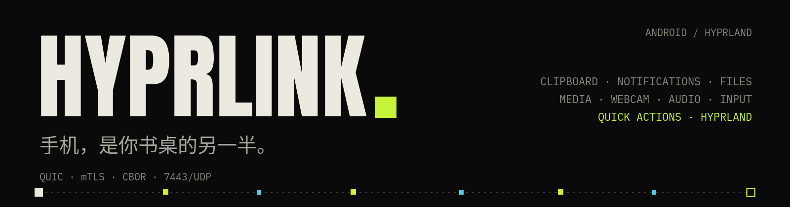

# HyprLink

[🇬🇧 English](README.md) · [🇵🇹 Português](README.pt.md) · 🇨🇳 **简体中文**

<p align="center"></p>

**Android ⇄ Linux/Hyprland 生态整合** — 理念类似苹果的 Continuity/Handoff，但面向 Hyprland 用户。剪贴板、通知、媒体、电量、远程触控板与键盘、文件传输、摄像头、音频和 Hyprland 控制，在手机与桌面之间实时同步，中间不依赖任何云服务。

连接在局域网内直连，使用 **QUIC + mTLS**（自签名证书双向认证，并固定证书指纹）；控制协议采用 **CBOR** 序列化。没有中继服务器：手机直接与电脑通信。

> **Alpha 版本（0.1.0）。** 开发者本人日常可用，但协议在版本之间仍可能变化，部分模块尚未完成（见[状态](#状态)）。请自行承担风险；欢迎反馈问题。

<p align="center"></p>

## 目录

[功能](#功能) · [状态](#状态) · [系统要求](#系统要求) · [安装](#安装) · [配对手机](#配对手机) · [使用](#使用) · [配置](#配置) · [故障排除](#故障排除) · [架构](#架构) · [从源码构建](#从源码构建) · [Android 应用](#android-应用) · [致谢](#致谢) · [许可证](#许可证)

## 功能

- **通知**：手机通知显示在电脑上，支持镜像、操作和清除；手机重新连接后恢复仍在显示的通知列表
- **双向剪贴板**，包括 PNG 图片
- **文件传输**：双向，带发送队列、进度、历史记录，下载目录可配置
- **媒体**：在手机上控制电脑的 MPRIS 播放器，显示进度和专辑封面；电脑上的播放器也会以通知形式出现在手机上
- **手机当电脑摄像头**（通过 v4l2loopback 提供 `/dev/video42`），支持 H.264 或 H.265
- **音频**：手机麦克风作为电脑输入、手机作为电脑扬声器，以及把电脑声音发送到手机
- **远程触控板与键盘**（经 `/dev/uinput`）：实时输入、回车、快捷键和鼠标按键（按下/松开；连接中断时会自动安全释放）
- **快捷操作**：锁屏、挂起、截图（全屏或区域，复制到剪贴板并保存）、音量、媒体键和 `hyprctl dispatch`
- **Hyprland**：工作区、窗口和实时事件；手机手势可映射为 dispatch。同时支持 Lua 配置（`hyprland.lua`）和传统配置
- **遥测**：双向电量；电脑的 CPU、内存、温度（hwmon）、磁盘剩余空间和 GPU 显示在手机上
- **Wake-on-LAN**：守护进程把电脑的 MAC 地址发给手机，方便手机唤醒电脑
- **桌面 GUI**（iced）作为独立进程运行，带托盘图标，支持五种语言：英语、葡萄牙语（葡萄牙和巴西）、西班牙语和中文

## 状态

| 模块 | 状态 |
|---|---|
| 连接（QUIC/mTLS，二维码配对） | ✅ |
| 桌面 GUI（iced，与守护进程分离，托盘图标） | ✅ |
| 双向剪贴板 | ✅ |
| Hyprland（工作区、窗口、dispatch、实时事件） | ✅ |
| 电量（电脑 ↔ 手机） | ✅ |
| 媒体（MPRIS：控制、正在播放、封面、手机通知） | ✅ |
| 远程触控板 / 键盘（实时输入、回车、快捷键） | ✅ |
| 快捷操作（锁屏、挂起、截图/区域截图、音量、媒体） | ✅ |
| 通知（镜像、操作、清除） | ✅ |
| 文件传输（发送队列、历史、打开文件夹） | ✅ |
| 手机端遥测（CPU、内存、温度、GPU、磁盘） | 🚧 温度/GPU 仍待验证 |
| 鼠标按键与拖动（`input.button`） | 🚧 守护进程已就绪；Android 应用待完成 |
| 手机手势（`gesture`） | 🚧 守护进程和 GUI 已就绪；Android 应用待完成 |
| 音频（混音器、在手机上听电脑声音、虚拟麦克风） | 🚧 |
| 摄像头（手机作为电脑摄像头/麦克风；H.264 和 H.265） | 🚧 |

详情见 [`CHANGELOG.md`](CHANGELOG.md) 和 [`PROTOCOL.md`](PROTOCOL.md)。

## 系统要求

已在 **Arch Linux / CachyOS** 和 **Hyprland**（Wayland）上测试。其他发行版应该也能运行，但下表的软件包名称是 Arch 的。

| 用途 | 软件包（Arch） |
|---|---|
| 基础 | `hyprland`、`pipewire`、`wireplumber`、`libpulse`（`pactl`）、`wl-clipboard` |
| 音频与摄像头（GStreamer） | `gst-plugins-base-libs`、`gst-plugins-good`、`gst-plugins-bad-libs`（H.265）、`gst-libav`（H.264/H.265 解码）、`gst-plugin-pipewire` |
| 虚拟摄像头 | `v4l2loopback-dkms`（守护进程通过 `pkexec` 在 `/dev/video42` 加载它） |
| GUI 文件选择器 | `xdg-desktop-portal` + `xdg-desktop-portal-gtk` |
| 快捷操作（可选） | 锁屏：`noctalia`、`hyprlock` 或 `loginctl`；截图：`grimblast` 或 `grim` + `slurp` |
| 编译 | `rust`、`clang`、`lld`、`pkgconf` |

远程触控板和键盘会写入 `/dev/uinput`：当前会话用户需要有写权限（用 `getfacl /dev/uinput` 检查）。

## 安装

软件包是 `packaging/arch/` 里的**本地 PKGBUILD**，名为 `hyprlink-bridge`（AUR 上的“hyprlink”是另一个项目）：

```bash
git clone https://github.com/mastermaiolo/hyprlink.git
cd hyprlink/packaging/arch
makepkg -si
systemctl --user enable --now hyprlink-bridge   # 守护进程，作为用户服务
hyprlink-gui                                     # GUI（应用菜单里也有）
```

它会把 `hyprlink-daemon`、`hyprlink-gui` 和 `hyprlinkctl` 安装到 `/usr/bin`，同时安装用户服务 `hyprlink-bridge.service` 和 `.desktop` 启动项。在标签发布之前，想用当前代码试用：`HYPRLINK_LOCAL=1 makepkg -si`。

该服务随图形会话启动（`graphical-session.target`）。使用 uwsm 时会自动完成。不用 uwsm 时通常不会激活这个 target：在 Hyprland 中加入 `exec-once = dbus-update-activation-environment --systemd --all`，再加 `exec-once = systemctl --user start hyprlink-bridge`。若想登录时让 GUI 在托盘中启动：`cp /usr/share/hyprlink-bridge/hyprlink-bridge-autostart.desktop ~/.config/autostart/`（uwsm 会读取 XDG 自启动），或在 Hyprland 中使用 `exec-once = hyprlink-gui`。

## 配对手机

1. 安装 Android 应用（[发布页面](https://github.com/mastermaiolo/hyprlink/releases)上的 APK；手机上需要允许“安装未知应用”）。
2. 守护进程运行时，在 GUI 中打开**设备 → 配对新设备**（如果是手动运行的守护进程，也可以在终端里扫码）。
3. 在应用中扫描二维码。二维码包含电脑证书的 SHA-256 指纹、`<电脑IP>:7443` 地址，以及一个令牌；令牌会在守护进程每次启动和每次配对之后更新。
4. 此后，只要两台设备处于同一网络，连接就会自动恢复。

**网络：**电脑和手机必须在同一局域网。守护进程只监听一个端口：**7443/UDP**（QUIC）。如果有防火墙，请只对本地网络开放该端口。

电脑的身份（证书和密钥）保存在 `~/.config/hyprlink/`；删除该文件夹后需要重新配对。

## 使用

GUI 始终**先显示手机**：已连接的设备排在电脑本身之前。按 `1`–`9` 跳转到对应页面，按 `0` 打开设置。页面依次为：封面、设备、桌面、摄像头与屏幕、音频、通知、共享、多媒体、传感器与在场、日志。

脚本、快捷键和状态栏可以使用 `hyprlinkctl`：

```
hyprlinkctl status         连接状态
hyprlinkctl ping           到手机的往返延迟
hyprlinkctl mic toggle     手机麦克风开/关   (on | off | toggle)
hyprlinkctl tap toggle     把电脑音频发送到手机
hyprlinkctl speaker toggle 手机作为电脑扬声器
hyprlinkctl ws 3           切换到工作区 3
hyprlinkctl open           打开（或聚焦）GUI
```

`hyprlinkctl --help` 会列出其余命令。`contrib/` 里有 Waybar 小部件和文件管理器右键菜单用的“通过 HyprLink 发送”`.desktop` 条目；`contrib/install.sh` 可以安装它们。

## 配置

设置保存在 `~/.config/hyprlink/config.json`，可在 GUI 中修改（**设置**；手势、快捷键和触控板在**桌面**页）。值得了解的几项：

- `download_dir` — 接收的文件存放位置
- `track` — 触控板灵敏度、滚动速度、加速、自然滚动，以及手机键盘开关
- `shortcuts` 和 `gestures` — 手机可以触发的 `hyprctl dispatch` 命令
- `battery_alerts` — 低电量和充满的阈值
- `disk_path` — 在手机上显示剩余空间的挂载点（默认 `$HOME`）
- `gpu_nvidia_wake` — 即使显卡休眠也读取 NVIDIA GPU 负载（默认关闭，避免遥测唤醒显卡）
- `lang` — GUI 语言

`HYPRLINK_MOCK=1 hyprlink-gui` 会用模拟的守护进程打开 GUI，无需手机。

## 故障排除

- **手机连不上。** 在同一局域网吗？**7443/UDP** 端口开放了吗？查看 `systemctl --user status hyprlink-bridge`。仍然不行的话，在 GUI 中移除设备后重新配对。
- **触控板或键盘没反应。** 会话用户需要对 `/dev/uinput` 有写权限（`getfacl /dev/uinput`）。
- **没有摄像头。** 安装 `v4l2loopback-dkms`；守护进程会请求权限（`pkexec`）在 `/dev/video42` 加载它。
- **登录时服务没有启动。** 不使用 uwsm 时，请看[安装](#安装)里关于 `graphical-session.target` 的说明。
- **锁屏或截图没反应。** 安装锁屏命令（`noctalia`、`hyprlock`）以及 `grimblast` 或 `grim` + `slurp`。
- **从头开始。** 删除 `~/.config/hyprlink/`（同时会忘记所有配对）。

## 架构

```
├── crates/
│   ├── hyprlinkd/            守护进程（Rust，二进制 hyprlink-daemon）— 无窗口
│   ├── hyprlink-gui/         桌面 GUI（iced，带自己的托盘图标）
│   ├── hyprlink-proto/       守护进程、GUI 与 hyprlinkctl 之间的契约（+ fmt.rs 中的文本）
│   └── hyprlinkctl/          命令行，用于脚本和快捷键
├── contrib/                  Waybar、.desktop、安装脚本
├── packaging/arch/           本地 PKGBUILD（软件包 hyprlink-bridge）
├── scripts/                  hyprlink-start.sh / hyprlink-stop.sh（守护进程 + GUI）、gui-capture.sh、release.sh
├── CHANGELOG.md              各版本变更
└── PROTOCOL.md               协议规范（权威来源）
```

守护进程没有窗口；GUI 是独立进程，通过 `$XDG_RUNTIME_DIR/hyprlink.sock` 与它通信。电脑与手机之间只有一条位于 7443/UDP 的 QUIC 连接，同时承载控制消息（双向流上的 CBOR）、数据（单向流）和电脑音频（QUIC DATAGRAM）。完整的线路规范——帧格式、CBOR 格式以及各模块的数据包目录——见 [`PROTOCOL.md`](PROTOCOL.md)。

技术栈：[`quinn`](https://github.com/quinn-rs/quinn)（QUIC）、`rustls`（TLS）、`ciborium`（CBOR）、[`iced`](https://github.com/iced-rs/iced)（GUI）、`ksni`（托盘）、`zbus`（D-Bus — MPRIS 和通知）、`uinput`（触控板/键盘）、GStreamer/PipeWire（音频和摄像头）。

## 从源码构建

```bash
# 最简单：启动守护进程和 GUI（使用 target/release 里的二进制）
scripts/hyprlink-start.sh            # --restart 重启；hyprlink-stop.sh 停止

# 或者手动，在两个终端中
cargo run --release -p hyprlinkd     # 守护进程（会显示配对二维码）
cargo run --release -p hyprlink-gui  # GUI
```

仓库自带 `.cargo/config.toml`，使用 **`clang` + `lld`** 作为链接器（`pacman -S clang lld`）：守护进程 debug 构建的链接时间从约 5 秒降到约 2 秒。

```bash
cargo build --profile fast -p hyprlinkd   # 用于迭代：无 LTO，16 个 codegen 单元
cargo build --release -p hyprlinkd        # 用于发布（LTO，overflow-checks = true）
```

`fast` 配置继承自 `release`，并设置 `lto = false`、`codegen-units = 16` 和 `overflow-checks = false`；**不要用于发布**。

## Android 应用

Android 应用（Kotlin/Jetpack Compose）单独开发和分发；本仓库只包含电脑端：守护进程、GUI 和 `hyprlinkctl`。目前计划把应用作为已签名的 APK 放在本仓库的[发布页面](https://github.com/mastermaiolo/hyprlink/releases)（尚未发布）。如果你想编写其他客户端，完整协议见 [`PROTOCOL.md`](PROTOCOL.md)。

## 致谢

[`quinn`](https://github.com/quinn-rs/quinn)、[`rustls`](https://github.com/rustls/rustls)、[`iced`](https://github.com/iced-rs/iced)、`ciborium`、`ksni` 和 `zbus` 承担了大量底层工作。GUI 和应用内置的字体——Anton、Instrument Serif、Inter、IBM Plex Mono 和 Noto Sans SC——采用 SIL Open Font License 1.1；许可文本见 `crates/hyprlink-gui/assets/fonts/OFL-*.txt`。

## 许可证

**GPL-3.0-or-later** — 见 [`LICENSE`](LICENSE)。

**重新授权：**直到 0.1.0 之前，代码以 MIT 发布。由于项目只有一位作者，从 0.1.0 起改为 GPL-3.0-or-later。已经获得早期版本的人仍可按 MIT 条款继续使用。
