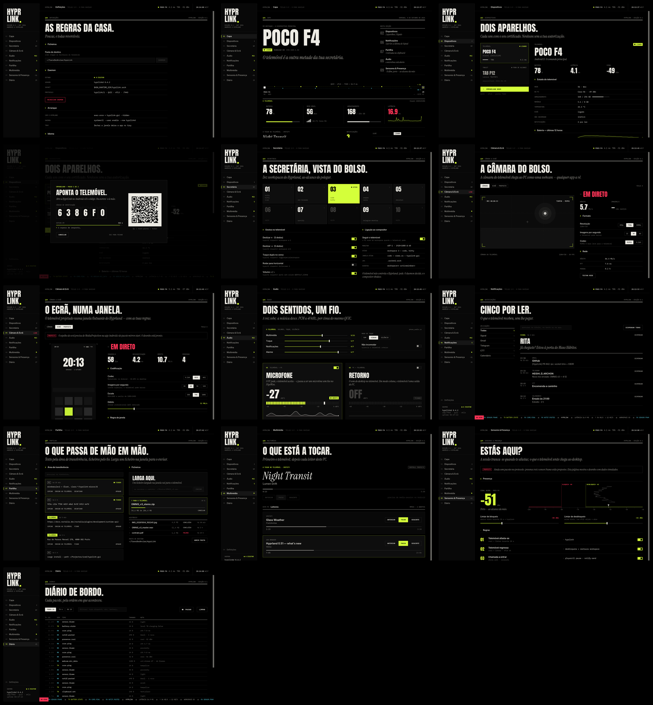
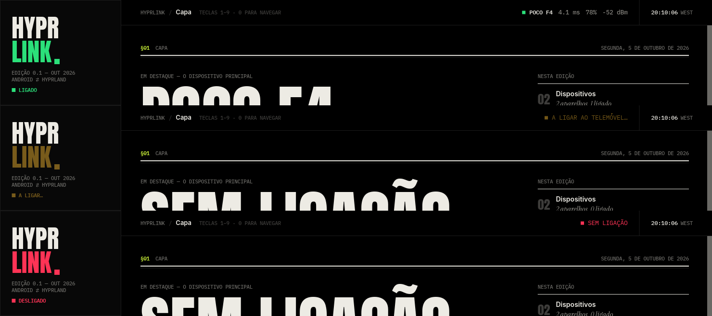

# HYPRLINK — GUI

Interface em [iced 0.14](https://iced.rs) para o HyprLink: a ponte Android ⇄ Hyprland
(QUIC + mTLS em `:7443`, extensão do protocolo KDE Connect com pacotes `hyprland.*`).

Preto, editorial, cyberpunk contido. Dez secções numeradas, como uma revista, e a ficha técnica:

| §  | Secção              | O que faz (telemóvel primeiro, PC depois) |
|----|---------------------|-------------------------------------------|
| 01 | Capa                | Telemóvel em destaque, índice da edição, link TX/RX, bateria/rede/armazenamento/latência, o que toca, ações rápidas, o fio, Este PC |
| 02 | Dispositivos        | Lista e ficha: estado do telemóvel, bateria 12 h + alertas, identidade (SHA-256), capacidades; emparelhamento com QR |
| 03 | Secretária          | 10 workspaces, gestos, compositor e janela ativa, atalhos `hyprctl dispatch` + campo livre, trackpad |
| 04 | Câmara & Ecrã       | Câmara do telemóvel → `/dev/video42` (resolução, fps, codec, teste de rede); Ecrã (espelho) marcado como proposto |
| 05 | Áudio               | Volumes, modo de toque e não-incomodar do telemóvel; microfone e retorno/modo coluna; misturador do PC |
| 06 | Notificações        | As do telemóvel: índice por app, pesquisa, a mais recente como manchete, dispensar |
| 07 | Partilha            | Clipboard (histórico, pesquisa, fixar, enviar) e ficheiros (largar na janela, progresso, cancelar, histórico, pasta) |
| 08 | Multimédia          | O que toca no telemóvel (controlo proposto) e leitores MPRIS do PC |
| 09 | Sensores & Presença | Escala RSSI, limiares, regras; seis sensores em ponte — proposto, com dados simulados |
| 10 | Diário              | Pacotes TX/RX com filtro, pesquisa, pausa |
| 00 | Definições          | Pasta de destino, daemon (reiniciar), arranque, idioma, sobre — no rodapé do rail |



Teclas `1`–`9` e `0` navegam entre secções; `Esc` fecha o emparelhamento. Largar um ficheiro na janela
envia-o para o telemóvel.

## Princípio: primeiro o outro lado

Na GUI do PC, o **telemóvel vem primeiro** — bateria, rede, armazenamento, o que está a tocar,
notificações — e só depois **Este PC** (CPU, memória, bateria do portátil, tempo ligado, lidos de
`/proc` e `/sys`, sem dependências). Na app Android será o inverso. A mesma regra vale para o tray,
para o `hyprlinkctl` (campos do JSON pela ordem de leitura) e para o plugin do Noctalia.

## Correr

Esta pasta é a **única fonte** da GUI (o antigo repositório de design em `~/Projectos/iced/hyprlink-gui`
está arquivado). Na raiz do workspace:

```sh
cargo run -p hyprlinkd                    # o daemon (terminal 1)
cargo run -p hyprlink-gui --release       # a GUI, liga-se a $XDG_RUNTIME_DIR/hyprlink.sock
HYPRLINK_MOCK=1 cargo run -p hyprlink-gui # sem daemon: simulador, para desenho e capturas
```

A app corre como `iced::daemon`: fechar a janela deixa-a no **system tray** (StatusNotifierItem,
via `ksni`). Para arrancar já escondida, no `hyprland.conf`:

```ini
exec-once = hyprlink-gui --hidden
```

O ícone segue o link: `Passive` sem telemóvel (o tray do Noctalia esconde-o por omissão,
`hide_passive`), `Active` com telemóvel ligado, `NeedsAttention` durante o emparelhamento.
Menu: Abrir · Ping · Enviar clipboard · Microfone ✓ · Espelho ✓ · Sair. A tooltip mostra
telemóvel · bateria · rede · latência.

## LINK = estado da ligação

A palavra **LINK** do logótipo (e o quadrado ao lado, o ponto do masthead e o núcleo do ícone do tray)
segue `LinkPhase`, que o daemon envia em `Event::Link`:

| Fase | Cor | Etiqueta |
|---|---|---|
| `Connected` | verde `#2BE07A` (`LINK_UP`) | ■ LIGADO |
| `Connecting` | âmbar dourado `#F4B731` (`LINK_WAIT`), a respirar (ciclo de 1,6 s) | ■ A LIGAR… |
| `Disconnected` | vermelho `#FF3355` (`LINK_DOWN` = `HOT`) | ■ DESLIGADO |



No simulador: `HYPRLINK_LINK=offline|connecting|cycle cargo run` (por omissão liga em menos de 1 s).
O JSON v1 do `hyprlinkctl` tem o campo `link` (`"connected"`, `"connecting"`, `"disconnected"`).

## hyprlinkctl

CLI para scripts, keybinds e plugins de shell (crate `crates/hyprlinkctl`), fala com o daemon pelo mesmo
socket:

```sh
cargo install --path crates/hyprlinkctl
hyprlinkctl status
hyprlinkctl watch --json          # uma linha JSON a cada 500 ms (--interval MS)
hyprlinkctl mic on|off|toggle     # tap …, speaker …, mirror start|stop|toggle, ws N, ping, clipboard, pair, open
```

O formato do JSON está em `crates/hyprlink-proto/src/snapshot.rs` (`v = 1`): desconhecido é `null`, nunca
um 0 falso; a rede do telemóvel vem estruturada e os tamanhos em bytes — quem mostra é que formata.
`cargo test -p hyprlink-proto` verifica a forma.

## Contrato com o daemon

`crates/hyprlink-proto/src/link/mod.rs`: só dados (regra 2). Todo o texto para humanos está em
`crates/hyprlink-proto/src/fmt.rs`; os nomes de pacotes (`módulo.ação`) estão em `link/packets.rs`
(reais, confirmados, propostos). O socket local está em `hyprlink-proto/src/ipc.rs` (envelope) e
`client.rs` (o `Transport` da GUI e a sessão do `hyprlinkctl`).

## Plugin do Noctalia v5

Está em `~/Projectos/noctalia-plugins/hyprlink` (a tua fonte local `local`). Ativar:

```sh
noctalia msg plugins enable maggio/hyprlink
```

e acrescentar o widget à barra (Definições → Barra → Adicionar widget → HYPRLINK).
Serviço com `runStream(hyprlinkctl watch --json)`, widget nativo (papéis da paleta) e um painel
"edição de bolso" com estilo HYPRLINK (Anton + ácido) ou Shell.

Variáveis úteis para desenvolvimento/capturas (com `HYPRLINK_MOCK=1`; `scripts/gui-capture.sh` faz as capturas):

```sh
HYPRLINK_SECTION=4  HYPRLINK_DEMO=webcam   cargo run   # Câmara ligada, rede testada
HYPRLINK_SECTION=4  HYPRLINK_DEMO=screen   cargo run   # modo Ecrã, espelho em direto (desenho)
HYPRLINK_SECTION=7  HYPRLINK_DEMO=transfer cargo run   # um envio a decorrer
HYPRLINK_SECTION=2  HYPRLINK_DEMO=pair     cargo run   # diálogo de emparelhamento
HYPRLINK_SECTION=11 cargo run                          # Definições
HYPRLINK_WINDOW_H=1800 cargo run                       # janela alta, para capturas da página inteira
```

No Hyprland, a janela tem `app_id = dev.hyprlink.gui`:

```ini
windowrulev2 = float, class:^(dev.hyprlink.gui)$
windowrulev2 = size 1480 940, class:^(dev.hyprlink.gui)$
```

## Estrutura

```
crates/hyprlink-gui/src/
  main.rs        arranque (iced::daemon), fontes embutidas, instância única
  lib.rs         transport() (socket real ou simulador), instance
  instance.rs    um segundo arranque só foca a janela
  app.rs         estado, mensagens, update, subscrições, moldura (rail, masthead, LINK, ticker, toasts)
  theme.rs       design system: cores (LINK_UP/WAIT/DOWN), tipografia, escala, estilos de widgets
  ui.rs          blocos editoriais (kicker, headline, deck, stat, kv, setting…)
  graphics.rs    canvas: sparkline, medidor LED, diagrama do link, telemóvel, escala RSSI, ticker
  views.rs       Capa, Dispositivos, Secretária, Áudio, Sensores & Presença, Diário + emparelhamento
  pages.rs       Câmara & Ecrã, Notificações, Partilha, Multimédia, Definições + blocos novos
  tray.rs        StatusNotifierItem (ksni): estado, tooltip, menu, ícone desenhado em código
crates/hyprlink-proto/src/
  link/mod.rs    o contrato: Command, Event, LinkPhase, trait Transport
  link/mock.rs, mock_more.rs   daemon simulado (feature `mock`, ligada por omissão)
  link/packets.rs              nomes de pacotes
  fmt.rs · host.rs · snapshot.rs · ipc.rs · client.rs
```

O daemon publica a fase da ligação (`Event::Link`) a partir de `ConnState`
(`crates/hyprlinkd/src/state.rs`); o LINK muda de cor com ela.

## Design system

- **Cor** — fundo `#000`, superfícies `#080808 / #0E0E0E / #161616`, filetes `#1C1C1C`.
  Texto em branco-jornal `#EDEBE4` (nunca `#FFF`). Um acento: ácido `#D4FF3A`.
  Um alarme: `#FF3355`. Ciano `#5FD4E8` reservado ao tráfego RX.
- **Tipo** — Anton (títulos, números, sempre em caixa alta) · Instrument Serif itálico
  (os "decks", a voz de revista) · Inter (interface) · IBM Plex Mono (etiquetas, dados, protocolo).
- **Grelha** — múltiplos de 4 px, cantos a 0, filetes de 1 px, goteira de 40 px.
- **Ritmo** — cada página abre igual: kicker `§NN`, filete duplo, título, deck, conteúdo.

## Fontes

Todas SIL Open Font License 1.1, embutidas em `assets/fonts/` com as respetivas licenças:
Anton (Vernon Adams), Instrument Serif (Instrument), Inter (Rasmus Andersson),
IBM Plex Mono (IBM).
